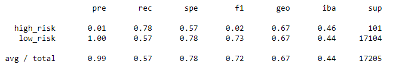

# Credit Risk Analysis

## Overview

We have undertaken this analysis to look at various supervised machine learning approaches to predicting credit card risk. Within this scope, we identified resampling models, including under and over sampling, a combination sampling, and Ensemble Classifiers to train and predict on the data provided.

## Resources
Data used: LoanStats_2019Q1.csv
Tools: Python, Pandas, Collections, Numpy, sklern, imblearn

## Analysis

### Naive Random Oversampling

* Accuracy: 64%
* High risk precision: .01
* High risk recall: .62

### SMOTE

* Accuracy: 66%
* High risk precision: .01
* High risk recall: .63

### Cluster Centroids Undersampling

* Accuracy: 54%
* High risk precision: .01
* High risk recall: .69

### SMOTEENN (SMOTE and Edited Nearest Neighbors) Combination

* Accuracy: 67%
* High risk precision: .01
* High risk recall: .75

### Balanced Random Forest Classifier

* Accuracy: 79%
* High risk precision: .03
* High risk recall: .70

### Easy Ensemble AdaBoost Classifier model

* Accuracy: 93%
* High risk precision: .09
* High risk recall: .92

## Summary

In our results and recommendations, it is critical to understand the use case, and what is most important, in building a model to identify hig risk credit situations. To achieve the desired result, we want to catch the largest percentage of the high risk credit situations as possible, but it is a minority in the data set, so it can be difficult to be perfect. Missing high risk data has a much higher price than accidentally identifying low risk as high risk; this pool can then be gone through manually, much easier than with the entire dataset.

With this in mind, each of these machine learning models improves in key characteristics over the last. We want the highest high risk recall that we can get. None of the above models demonstrated good precision. The highest, the Easy Ensemble AdaBoost Classifier model, was only .09, which means our net will catch a lot of low risk as high risk. This model does achieve an impressive .92, meaning it is doing a good job catching all the high risk as high risk. Thus, the recommendation to proceed with is the Easy Ensemble AdaBoost Classifier model, and then filter that data set by hand if we need to strain out the low rish that ended up in that categorty.

